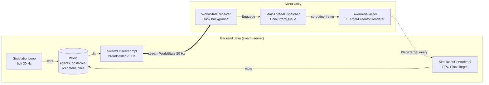
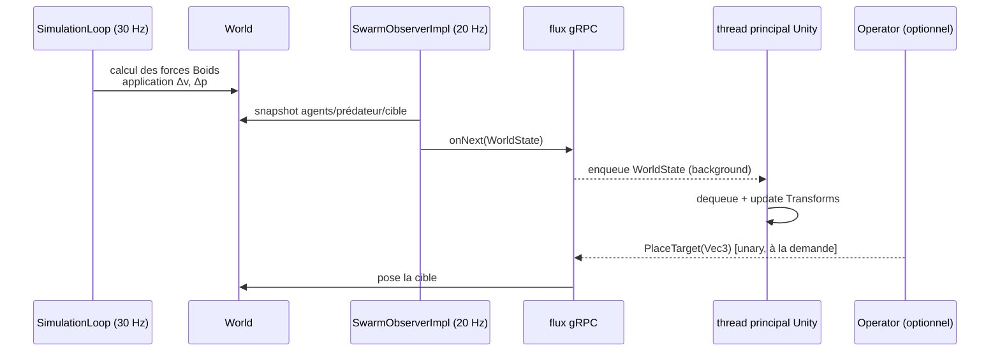

# gakkel-swarm-simulator

> Simulateur distribué d'essaims de drones sous-marins coordonnés.
> Modèle Boids de Reynolds avec évitement d'obstacles et réaction à la menace.

[](https://github.com/gakkel-labs/swarm-simulator/actions)
[](LICENSE)
[](https://openjdk.org/projects/jdk/21/)


> English version: [`README.md`](README.md)

Fait partie de [l'univers Gakkel](https://github.com/gakkel-labs), une série de projets
perso autour de la robotique sous-marine profonde :
[fleet-dashboard](https://github.com/gakkel-labs/fleet-dashboard),
[drone-embedded](https://github.com/gakkel-labs/drone-embedded).

---

## De quoi s'agit-il

Un petit système distribué bien réel : un **backend Java** fait tourner une simulation
3D de flocking (règles Boids, obstacles, prédateur, cible de recherche) et pousse l'état
du monde à 20 Hz via un canal **gRPC server-streaming**. Un **client Unity** s'abonne au
flux et rend l'essaim sous forme de capsules grises — minimaliste à dessein, pour laisser
toute la place au comportement émergent.

Le scénario est une **mission Recherche et Secours (SAR) maritime** :

- Les *explorers* se dispersent et détectent la cible.
- Un *operator* confirme la position.
- Les *carriers* convergent pour l'extraction.

L'objectif n'est pas la fidélité — c'est étudier des patterns de coordination, du gRPC
streaming sous des fréquences réelles, et une frontière inter-processus propre qui
accueillera plus tard un agent Raspberry Pi (roadmap v0.3).

---

## Quickstart — lancer la démo en 2 minutes

### Prérequis

| Outil        | Version              | Notes                                            |
|--------------|----------------------|--------------------------------------------------|
| JDK          | 21 (Temurin OK)      | `java -version` doit reporter 21                 |
| Maven        | 3.9+                 | `mvn -v`                                         |
| Unity Hub    | avec Editor 2022.3 LTS | template URP                                   |
| Port libre   | `50051` (gRPC)       | Modifier `SwarmServer.PORT` au besoin            |

### 1. Démarrer le backend

```bash
mvn -pl swarm-server -am package
mvn -pl swarm-server exec:java -Dexec.mainClass="fr.gakkel.swarmsimulator.swarmserver.server.SwarmServer"
```

Tu dois voir :

```
SwarmServer on :50051 — sim 30Hz — stream 20Hz
```

### 2. Ouvrir le client Unity

1. Dans **Unity Hub**, *Add project from disk* → sélectionner `unity-client/`.
2. Ouvrir le projet avec **Unity 2022.3 LTS**.
3. Charger la scène `Assets/Scenes/SampleScene.unity`.
4. Cliquer **Play**.

### 3. Résultat attendu

- Des capsules grises apparaissent et se mettent à flocker (cohésion + séparation +
  alignement).
- Un prédateur rouge dérive dans la boîte ; les capsules proches s'enfuient.
- Clic gauche dans la scène pour **placer la cible SAR** — les explorers convergent,
  l'événement *found* se déclenche et les carriers s'approchent.

Si quelque chose coince, la cause la plus fréquente est le port gRPC déjà occupé —
tuer la JVM précédente ou changer `PORT` dans
[`SwarmServer.java`](swarm-server/src/main/java/fr/gakkel/swarmsimulator/swarmserver/server/SwarmServer.java).

---

## Architecture

Deux processus indépendants qui communiquent en gRPC. Le backend est la seule autorité
sur l'état de simulation ; Unity n'est qu'un consommateur visuel.



### Runtime flow — un tick



Pour aller plus loin : [`docs/architecture.fr.md`](docs/architecture.fr.md)
(remap de repère NED↔Unity, modèle de threading, accès concurrent au World, catalogue
complet des messages).

### Le pourquoi des choix — ADRs

- [ADR-0001](docs/adr/0001-grpc-streaming.fr.md) — **gRPC server-streaming** pour
  pousser WorldState à 20 Hz (vs polling ou WebSockets).
- [ADR-0002](docs/adr/0002-no-spring-boot-for-mvp.fr.md) — **Pas de Spring Boot** pour
  le MVP ; `main()` + `ScheduledExecutorService` + `ServerBuilder` suffisent.
- [ADR-0003](docs/adr/0003-minimal-3d-assets.fr.md) — **Assets 3D minimalistes**
  (capsules grises, primitives) pour garder l'attention sur le comportement émergent,
  pas sur l'art.
- [ADR-0004](docs/adr/0004-target-placement-operator-triggered.fr.md) — **Placement
  de la cible déclenché par l'opérateur**, architecture prête pour de l'automatisation.

---

## Structure du repo

| Chemin           | Rôle                                                              |
|------------------|-------------------------------------------------------------------|
| `contracts/`     | Fichiers `.proto` + stubs Java générés (package `gakkel.swarm.v1`) |
| `swarm-server/`  | Serveur gRPC, modèle de domaine, boucle de simulation Boids       |
| `tests/`         | Tests d'intégration bout en bout                                  |
| `unity-client/`  | Projet Unity 2022.3 LTS / URP — client visuel                     |
| `docs/`          | Architecture, ADRs, deep dives par domaine, snapshots tech-debt   |

---

## Stack

- **Backend** — Java 21, Maven 3.9+, grpc-java 1.81, protobuf 3.25, SLF4J + Logback.
- **Client** — Unity 2022.3 LTS (URP), Grpc.Core C# / Grpc.Net.Client.
- **Tests** — JUnit 5, Mockito, AssertJ.
- **Futur** — Raspberry Pi (Ubuntu Server 22.04) en client gRPC hybride (v0.3).

Conventions de code, style de réponse et workflow Claude Code dans
[`CLAUDE.md`](CLAUDE.md). TL;DR : Google Java Style, JUnit 5 + Mockito, conventional
commits, anglais dans le code et FR+EN dans la doc.

---

## Tests

```bash
# tests unitaires (par module)
mvn -pl swarm-server test

# tests d'intégration
mvn -pl tests -am verify

# build complet (compile + tests, tous modules)
mvn verify
```

---

## Roadmap

| Version | Périmètre                                          | Statut     |
|---------|----------------------------------------------------|------------|
| v0.1    | Boids + obstacles + prédateur + scénario SAR       | 🚧 en cours |
| v0.2    | Dockerisation                                      | ⏳ prévu    |
| v0.3    | Agent Raspberry Pi hybride                         | ⏳ prévu    |
| v0.4    | 3 types de drones différenciés                     | ⏳ prévu    |
| v0.5    | ACO + tracking Kalman                              | ⏳ prévu    |
| v0.6    | Démo physique multi-Pi                             | ⏳ prévu    |

---

## Pour aller plus loin

- [`docs/architecture.fr.md`](docs/architecture.fr.md) — flux backend ↔ Unity,
  threading, remap de repère.
- [`docs/01-boids-rules.fr.md`](docs/01-boids-rules.fr.md) — le cœur algorithmique.
- [`docs/02-grpc-contract.fr.md`](docs/02-grpc-contract.fr.md) — référence du protocole
  fil.
- [`docs/03-unity-integration.fr.md`](docs/03-unity-integration.fr.md) — pont gRPC
  thread-safe.
- [`docs/notes-threading-grpc-unity.md`](docs/notes-threading-grpc-unity.md) — notes
  de conception.
- [`docs/tech-debt/`](docs/tech-debt/) — snapshots tech-debt périodiques.

---

## Crédits

- Craig W. Reynolds — *Flocks, Herds, and Schools: A Distributed Behavioral Model* (1987).
- L'univers Gakkel : [fleet-dashboard](https://github.com/gakkel-labs/fleet-dashboard),
  [drone-embedded](https://github.com/gakkel-labs/drone-embedded).

## Licence

MIT — voir [`LICENSE`](LICENSE).
