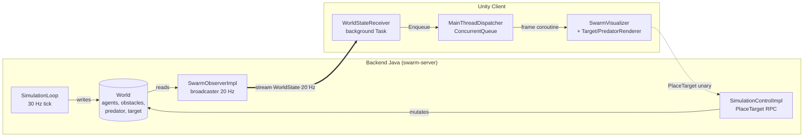
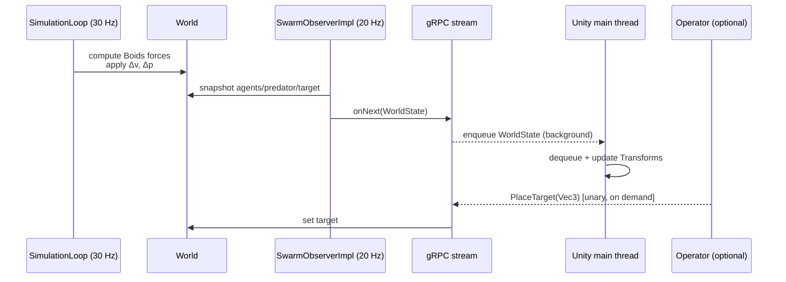

# gakkel-swarm-simulator

> Distributed simulator of coordinated underwater drone swarms.
> Reynolds' Boids model with obstacle avoidance and threat response.

[](https://github.com/gakkel-labs/swarm-simulator/actions)
[](LICENSE)
[](https://openjdk.org/projects/jdk/21/)


> Version française : [`README.fr.md`](README.fr.md)

Part of the [Gakkel universe](https://github.com/gakkel-labs) of personal projects
exploring deep-sea robotics: [fleet-dashboard](https://github.com/gakkel-labs/fleet-dashboard),
[drone-embedded](https://github.com/gakkel-labs/drone-embedded).

---

## What it is

A small but real distributed system: a **Java backend** runs a 3D flocking simulation
(Boids rules, obstacles, predator, search target) and pushes the world state at 20 Hz
over a **gRPC server-streaming** channel. A **Unity client** subscribes to that stream
and renders the swarm as plain grey capsules — visually minimal on purpose, so the
emergent behavior takes the spotlight.

The scenario is **Maritime Search and Rescue (SAR)**:

- *Explorers* spread out and detect the target.
- An *operator* confirms the position.
- *Carriers* converge to extract.

The point isn't fidelity — it's to study coordination patterns, gRPC streaming under
real frequencies, and a clean cross-process boundary that can later host a Raspberry
Pi agent (v0.3 roadmap).

---

## Quickstart — run the demo in 2 minutes

### Prerequisites

| Tool         | Version              | Notes                                          |
|--------------|----------------------|------------------------------------------------|
| JDK          | 21 (Temurin OK)      | `java -version` should report 21               |
| Maven        | 3.9+                 | `mvn -v`                                       |
| Unity Hub    | with Editor 6000.4.6f1 (Unity 6) | URP template                       |
| Free port    | `50051` (gRPC)       | Override with `SWARM_PORT` (see [Configuration](#configuration)) |

### 1. Start the backend

```bash
mvn -pl swarm-server -am package
mvn -pl swarm-server exec:java -Dexec.mainClass="fr.gakkel.swarmsimulator.swarmserver.server.SwarmServer"
```

You should see:

```
SwarmServer on :50051 — sim 30Hz — stream 20Hz
```

### 2. Open the Unity client

1. In **Unity Hub**, *Add project from disk* → select `unity-client/`.
2. Open the project with **Unity 6 (6000.4.6f1)**.
3. Load the scene `Assets/Scenes/SampleScene.unity`.
4. Hit **Play**.

### 3. Expected result

- Grey capsules spawn and start flocking (cohesion + separation + alignment).
- A red predator drifts through the bounding box; nearby capsules flee.
- Left-click in the scene to **place the SAR target** — explorers converge,
  the *found* event fires and the carriers move in.

If something goes wrong, the most common cause is the gRPC port already being bound —
kill the previous JVM or start the backend on another port with `SWARM_PORT=50052 …`
(see [Configuration](#configuration)).

---

## Configuration

All runtime parameters are read **once at startup** with the precedence
**environment variable → `application.properties` → built-in default**. No flags, no
recompilation — set an environment variable (12-factor / Docker friendly) or uncomment a
key in [`swarm-server/src/main/resources/application.properties`](swarm-server/src/main/resources/application.properties).
With nothing set, the simulation is identical to before this was introduced.

```bash
# examples
SWARM_PORT=50052 mvn -pl swarm-server exec:java -Dexec.mainClass="…server.SwarmServer"
SWARM_SEED=12345 SWARM_AGENT_COUNT=40 mvn -pl swarm-server exec:java -Dexec.mainClass="…"
```

| Variable | Property | Default | Meaning |
|----------|----------|---------|---------|
| `SWARM_PORT` | `swarm.port` | `50051` | gRPC listen port |
| `SWARM_AGENT_COUNT` | `swarm.agent-count` | `20` | Number of explorer agents |
| `SWARM_WORLD_WIDTH` | `swarm.world.width` | `100` | World X extent |
| `SWARM_WORLD_HEIGHT` | `swarm.world.height` | `100` | World Y extent |
| `SWARM_WORLD_DEPTH` | `swarm.world.depth` | `50` | World Z extent |
| `SWARM_SEED` | `swarm.seed` | `42` | RNG seed — see below |
| `SWARM_BOIDS_*` | `swarm.boids.*` | (per rule) | Boids weights & radii (perception-radius, separation-weight, alignment-weight, cohesion-weight, wander-weight, max-speed, boundary-repulsion-{radius,weight}, obstacle-avoidance-{radius,weight}, threat-flee-{radius,weight}) |
| `SWARM_DIAG_*` | `swarm.diag.*` | (per threshold) | Diagnostics thresholds (immobile-threshold-fraction, frozen-threshold-fraction, dispersal-limit-fraction, flocking-lost-fraction, stability-tolerance, stability-samples) |

The full list of `SWARM_BOIDS_*` / `SWARM_DIAG_*` names with their defaults lives, commented,
in `application.properties`.

### Seed & reproducibility

`SWARM_SEED` makes a run reproducible: **the same seed reproduces the same simulation
dynamics** — agent positions, velocities, predator-respawn and the wander force all derive
from it. This is what benchmarking and headless CI runs build on.

- `SWARM_SEED=<integer>` — deterministic, reproducible run.
- `SWARM_SEED=random` (or `none`) — a fresh seed is drawn at startup **and logged**, so an
  interesting run can be replayed by passing that value back.
- *unset* — defaults to `42` (deterministic), preserving the historical behaviour.

Note: agent **identifiers** (UUIDs) are not seeded, so they differ from run to run. The
physical simulation (positions, metrics, detection order) is identical; only the IDs in log
lines such as `Target found by agent <id>` change.

> Tip — to compare two Boids configurations fairly, run each over the **same set of seeds**
> (e.g. `SWARM_SEED=1…100` for both) so the difference reflects the configuration, not the
> random initial conditions.

---

## Architecture

Two independent processes communicating over gRPC. The backend is the only authority
on simulation state; Unity is a pure visual consumer.



### Runtime flow — one tick



Deeper dive: [`docs/architecture.md`](docs/architecture.md) (frame remapping NED↔Unity,
thread model, concurrent World access, full message catalogue).

### Why these choices — ADRs

- [ADR-0001](docs/adr/0001-grpc-streaming.md) — **gRPC server-streaming** to push
  WorldState at 20 Hz (vs. polling or WebSockets).
- [ADR-0002](docs/adr/0002-no-spring-boot-for-mvp.md) — **No Spring Boot** for the MVP;
  `main()` + `ScheduledExecutorService` + `ServerBuilder` is enough.
- [ADR-0003](docs/adr/0003-minimal-3d-assets.md) — **Minimal 3D assets** (grey capsules,
  primitives) so the focus stays on emergent behavior, not art.
- [ADR-0004](docs/adr/0004-target-placement-operator-triggered.md) — **Operator-triggered
  target placement**, architecturally pluggable for later automation.

---

## Repository layout

| Path             | Role                                                          |
|------------------|---------------------------------------------------------------|
| `contracts/`     | `.proto` files + generated Java stubs (package `gakkel.swarm.v1`) |
| `swarm-server/`  | gRPC server, domain model, Boids simulation loop              |
| `tests/`         | End-to-end integration tests                                  |
| `unity-client/`  | Unity 6 (6000.4.6f1) / URP project — visual client            |
| `docs/`          | Architecture, ADRs, per-area deep dives, tech-debt snapshots  |

---

## Stack

- **Backend** — Java 21, Maven 3.9+, grpc-java 1.81, protobuf 3.25, SLF4J + Logback.
- **Client** — Unity 6 (6000.4.6f1, URP), Grpc.Core C# / Grpc.Net.Client.
- **Tests** — JUnit 5, Mockito, AssertJ.
- **Future** — Raspberry Pi (Ubuntu Server 22.04) as a hybrid gRPC client (v0.3).

Code conventions, response style and Claude Code workflow live in
[`CLAUDE.md`](CLAUDE.md). TL;DR: Google Java Style, JUnit 5 + Mockito, conventional
commits, English in code and FR+EN in docs.

---

## Tests

```bash
# unit tests (per module)
mvn -pl swarm-server test

# integration tests
mvn -pl tests -am verify

# full build (compile + tests, all modules)
mvn verify
```

---

## Roadmap

| Version | Scope                                              | Status |
|---------|----------------------------------------------------|--------|
| v0.1    | Boids + obstacles + predator + SAR scenario        | 🚧 in progress |
| v0.2    | Dockerization                                      | ⏳ planned |
| v0.3    | Hybrid Raspberry Pi agent                          | ⏳ planned |
| v0.4    | 3 differentiated drone types                       | ⏳ planned |
| v0.5    | ACO + Kalman tracking                              | ⏳ planned |
| v0.6    | Multi-Pi physical demo                             | ⏳ planned |

---

## Going further

- [`docs/architecture.md`](docs/architecture.md) — backend ↔ Unity flow, threading,
  frame remapping.
- [`docs/01-boids-rules.md`](docs/01-boids-rules.md) — the algorithmic core.
- [`docs/02-grpc-contract.md`](docs/02-grpc-contract.md) — wire protocol reference.
- [`docs/03-unity-integration.md`](docs/03-unity-integration.md) — thread-safe gRPC
  bridge.
- [`docs/notes-threading-grpc-unity.md`](docs/notes-threading-grpc-unity.md) — design
  notes.
- [`docs/tech-debt/`](docs/tech-debt/) — periodic tech-debt snapshots.

---

## Credits

- Craig W. Reynolds — *Flocks, Herds, and Schools: A Distributed Behavioral Model* (1987).
- The Gakkel universe: [fleet-dashboard](https://github.com/gakkel-labs/fleet-dashboard),
  [drone-embedded](https://github.com/gakkel-labs/drone-embedded).

## License

MIT — see [`LICENSE`](LICENSE).
