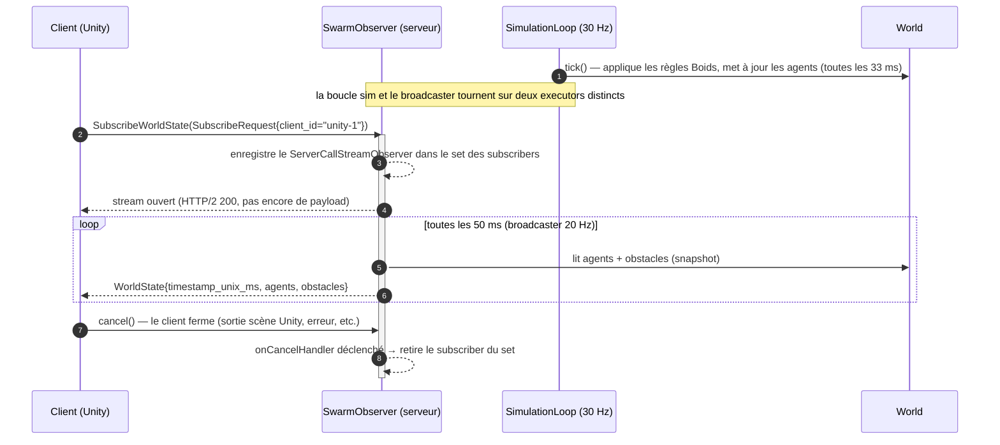

# Contrat gRPC — SwarmObserver v1

> Documentation de référence du protocole wire entre le serveur d'essaim et ses clients de visualisation (Unity, futur agent Raspberry Pi, outils CLI).
> Source de vérité : [`contracts/src/main/proto/swarm_observer.proto`](../contracts/src/main/proto/swarm_observer.proto).

---

## 1. Vue d'ensemble

Le simulateur expose un seul service public, `SwarmObserver`, en gRPC. Le service suit un pattern **broadcast / observer** :

- Un client ouvre **une** souscription longue durée via `SubscribeWorldState`.
- Le serveur pousse un snapshot `WorldState` à **20 Hz** tant que le stream reste ouvert.
- Le client n'envoie jamais de seconde requête sur le même stream — il consomme, ou annule.

Pas d'authentification, pas d'upload client→serveur, pas de messaging bidirectionnel. Le MVP tourne en local et fait confiance à tout ce qui arrive sur `localhost:50051`.

**Pourquoi server-streaming et pas du polling unaire ?**
Une visualisation à 20 Hz en RPC unaires, c'est 20 round-trips par seconde par client (≈ 60 ms d'overhead TCP+HTTP/2 par seconde). Un seul RPC server-streaming ouvre un seul stream HTTP/2 et le réutilise pour toutes les frames — latence plus faible, CPU plus faible, pas de scheduler côté client.

---

## 2. Diagramme de séquence

Cycle de vie complet d'une session client :



**Notes :**
- Le tick de simulation (30 Hz, `SimulationLoop.TICK_RATE_HZ`) et le broadcast (20 Hz, `SwarmObserverImpl.STREAM_RATE_HZ`) sont volontairement **découplés**. Les clients reçoivent le dernier état du monde, pas chaque pas physique.
- Le serveur maintient un `Set<ServerCallStreamObserver<WorldState>>`. Chaque broadcast itère ce set ; les subscribers annulés sont retirés paresseusement au tick suivant.
- Le stream **ne se termine jamais** côté serveur en fonctionnement normal. C'est le client qui le ferme.

---

## 3. Messages

Tous les messages sont en proto3. Les numéros de champ sont stables — jamais de renumérotation ou de réaffectation, uniquement de l'ajout.

### 3.1 `Vec3`

```proto
message Vec3 {
  float x = 1;
  float y = 2;
  float z = 3;
}
```

Vecteur 3D en **mètres**, repère **NED** (cf. §5.1). Utilisé pour les positions comme pour les vitesses — le contexte est donné par le nom du champ parent (`position_xyz` vs `velocity_mps`).

`float` (32 bits) suffit : les positions sont bornées par un monde de 100 × 100 × 50 m, une précision sub-millimétrique est du gâchis pour une visualisation à l'écran.

### 3.2 `AgentType`

```proto
enum AgentType {
  AGENT_TYPE_UNSPECIFIED = 0;
  AGENT_TYPE_EXPLORER    = 1;
  AGENT_TYPE_OPERATOR    = 2;
  AGENT_TYPE_CARRIER     = 3;
}
```

Rôle d'un drone dans le scénario SAR. Le membre `UNSPECIFIED = 0` est la valeur par défaut imposée par proto3 — la recevoir indique soit un bug serveur, soit une asymétrie de compatibilité (un rôle futur que le client ne connaît pas). Les clients doivent afficher les valeurs inconnues avec un fallback plutôt que de planter.

Les trois rôles mappent 1:1 sur l'enum domaine `fr.gakkel.swarmsimulator.swarmserver.domain.AgentType`. En v0.1 tous les agents sont `EXPLORER` ; la différenciation est prévue pour v0.4.

### 3.3 `AgentState`

```proto
message AgentState {
  string    id           = 1; // UUID
  AgentType type         = 2;
  Vec3      position_xyz = 3; // mètres, NED
  Vec3      velocity_mps = 4; // m/s
}
```

Snapshot d'un agent à l'instant du broadcast.

- `id` — UUID RFC 4122 **sous forme string** (ex. `"6f5a...c3d2"`). Stable pour la durée de vie de l'agent ; les clients peuvent l'utiliser comme clé de dictionnaire pour du rendu stateful (trails, sélection, etc.).
- `type` — cf. §3.2.
- `position_xyz` — centre de l'agent, mètres, NED.
- `velocity_mps` — vitesse instantanée, m/s, NED. La magnitude est bornée par `BoidsConfig.maxSpeed` (défaut 5.0 m/s).

Pas de champ d'orientation — les agents sont des masses ponctuelles (boids) en v0.1. Le cap visuel est dérivé côté client à partir de `velocity_mps`.

### 3.4 `Obstacle`

```proto
message Obstacle {
  Vec3  position_xyz = 1; // centre, mètres NED
  float radius_m     = 2;
}
```

Obstacle sphérique statique. Renvoyé à chaque frame même s'il est immuable aujourd'hui — ça garde le protocole simple (pas de RPC "world geometry" séparé) et laisse la porte ouverte à des obstacles dynamiques plus tard.

Les obstacles n'ont pas d'`id`. Les clients doivent les re-keyer par `(position, radius)`, ou simplement reconstruire la liste visuelle à chaque frame.

### 3.5 `PredatorState`

```proto
message PredatorState {
  string id           = 1;
  Vec3   position_xyz = 2;
  Vec3   velocity_mps = 3;
}
```

Snapshot du prédateur autonome à l'instant de la broadcast.

- `id` — chaîne fixe `"predator-0"` en v0.1 (prédateur unique). Plusieurs prédateurs utiliseraient des IDs distincts — les clients doivent indexer par `id` pour un rendu avec état.
- `position_xyz` — centre du prédateur, mètres, NED. Même repère que `AgentState.position_xyz`.
- `velocity_mps` — vitesse instantanée, m/s, NED. Magnitude bornée par `Predator.SPEED` (3.0 m/s — intentionnellement plus lent que les boids pour créer de la tension dramatique).

Pas de champ d'orientation — le cap visuel est déduit côté client depuis `velocity_mps`.

### 3.6 `WorldState`

```proto
message WorldState {
  int64                    timestamp_unix_ms = 1;
  repeated AgentState      agents            = 2;
  repeated Obstacle        obstacles         = 3;
  repeated PredatorState   predators         = 4;
  SearchStatus             search_status     = 5;
  float                    sensor_radius_m   = 6;
  float                    cohesion_spread_m = 7;
}
```

Snapshot complet du monde simulé à l'instant `timestamp_unix_ms`.

- `timestamp_unix_ms` — horloge wall-clock du serveur au moment où la frame est construite (`System.currentTimeMillis()`). Cf. §5.3.
- `agents` — tous les agents du monde. L'ordre **n'est pas** garanti ; les clients doivent indexer par `id`.
- `obstacles` — tous les obstacles du monde. Une liste vide est légale.
- `predators` — tous les prédateurs du monde. Contient exactement **1 entrée** en v0.1. Une liste vide est légale (scénarios sans prédateur). Les clients doivent gérer une liste vide — détruire le GameObject prédateur si la liste devient vide.
- `search_status` — présent uniquement quand une cible a été placée via `PlaceTarget`. Absent jusqu'à ce moment (valeur par défaut proto3).
- `sensor_radius_m` — rayon de détection partagé par tous les agents, en mètres. Les clients l'utilisent pour dimensionner l'overlay de zone de détection.
- `cohesion_spread_m` — dispersion moyenne des positions (écart-type par rapport au centroïde) lissée sur les 30 derniers ticks (~1 s). Zéro jusqu'au premier tick. Utilisé par le HUD Unity et exporté dans `metrics/cohesion-*.csv`.

Chaque frame est **auto-suffisante** — pas de diff, pas de delta. Un client qui se connecte en cours de simulation reçoit un état complet dès sa première frame.

### 3.7 `SubscribeRequest`

```proto
message SubscribeRequest {
  string client_id = 1; // étiquette arbitraire pour les logs serveur
}
```

Envoyée **une seule fois** par le client à l'ouverture du stream. Le seul champ, `client_id`, est une étiquette libre (ex. `"unity-editor"`, `"unity-build-win-1"`, `"cli-debug"`) utilisée par le serveur pour identifier les subscribers dans les logs :

```
[swarm-grpc] client 'unity-editor' subscribed — 1 total
[swarm-grpc] client 'unity-editor' disconnected — 0 remaining
```

Le serveur ne valide pas, ne déduplique pas, et n'impose pas l'unicité de `client_id` — c'est purement un outil de diagnostic opérateur.

---

## 4. RPC — `SubscribeWorldState`

```proto
service SwarmObserver {
  rpc SubscribeWorldState(SubscribeRequest) returns (stream WorldState);
}
```

| Aspect                | Valeur                                                                |
| --------------------- | --------------------------------------------------------------------- |
| Cardinalité           | **Server streaming** (1 requête → N réponses)                        |
| Input                 | `SubscribeRequest` (envoyé une fois à l'ouverture)                    |
| Output                | `stream WorldState`                                                   |
| Cadence cible         | **20 Hz** (1 frame toutes les 50 ms — `STREAM_RATE_HZ`)               |
| Frames auto-suffisantes | Oui — pas de delta, pas de diff                                     |
| Fin du stream         | À l'initiative du client ; le serveur ne ferme qu'à l'arrêt           |
| Backpressure          | Frames droppées silencieusement si `onNext` échoue (cf. §4.3)         |

### 4.1 Sémantique du streaming

Le broadcaster serveur tourne sur un `ScheduledExecutorService` dédié (thread `swarm-broadcaster`) à période fixe de `1000 / STREAM_RATE_HZ` ms = **50 ms**. À chaque tick :

1. Construire un seul `WorldState` à partir du `World` courant (une allocation par tick, partagée entre subscribers).
2. Pour chaque subscriber, vérifier `isCancelled()` ; si oui, le retirer du set.
3. Sinon, appeler `onNext(state)`. Les exceptions sont attrapées — le subscriber est retiré du set et loggé.

Pas de heartbeat ni de frame keepalive séparée de `WorldState`. La cadence à 20 Hz est suffisamment dense pour que le keepalive HTTP/2 par défaut de gRPC suffise.

### 4.2 Modes de défaillance (côté client)

| Symptôme                                       | Cause probable                                          |
| ---------------------------------------------- | ------------------------------------------------------- |
| `UNAVAILABLE` au subscribe                     | Serveur non démarré, mauvais port (défaut `:50051`)     |
| Stream qui stagne (pas de `WorldState` > 200 ms) | Serveur surchargé, pause GC, ou boucle sim crashée    |
| `CANCELLED` levé côté client                   | Le client lui-même a annulé (timeout, sortie scène)     |
| `INTERNAL` levé en cours de stream             | Exception côté serveur dans `buildWorldState`           |

Les clients doivent traiter tout statut terminal comme **fin de session** et réémettre `SubscribeWorldState` pour récupérer — le protocole est volontairement idempotent.

### 4.3 Backpressure

L'implémentation actuelle ne fait **pas** de flow-control. Si un client lent n'arrive pas à drainer les frames à 20 Hz, le buffer sortant gRPC se remplit, `onNext` finit par throw, et le subscriber est retiré. Pas de retry. C'est acceptable pour v0.1 (un seul client Unity sur `localhost`) ; une politique token-bucket ou basée sur `setOnReadyHandler` est sur la roadmap si la livraison multi-clients / WAN devient un besoin.

---

## 5. Conventions

### 5.1 Repère — NED (mètres)

Toutes les valeurs `Vec3` sont exprimées dans le repère **NED** (North / East / Down) main droite, **en mètres** :

| Axe   | Direction     | Étendue (monde par défaut) |
| ----- | ------------- | -------------------------- |
| `x`   | Nord          | `[0, 100]` m               |
| `y`   | Est           | `[0, 100]` m               |
| `z`   | Bas           | `[0, 50]` m                |

**Pourquoi NED :** convention standard aérospatiale / marine, alignée avec le projet `gakkel-drone-embedded`, et compatible avec des données de navigation AUV réelles (compas, capteur de profondeur) en v0.3+.

**Note client Unity :** Unity utilise un repère main gauche Y-up. La conversion se fait côté client à la désérialisation, pas sur le wire :

```
unity.x =  proto.y     // Est  → Unity X
unity.y = -proto.z     // Bas  → Unity -Y (Y-up)
unity.z =  proto.x     // Nord → Unity Z
```

### 5.2 Unités

| Grandeur     | Unité  | Convention de nommage proto | Exemple de champ    |
| ------------ | ------ | --------------------------- | ------------------- |
| Position     | mètre  | `_xyz`                      | `position_xyz`      |
| Vitesse      | m/s    | `_mps`                      | `velocity_mps`      |
| Longueur     | mètre  | `_m`                        | `radius_m`          |
| Temps        | ms     | `_ms` (ou `_unix_ms`)       | `timestamp_unix_ms` |

L'unité fait partie du **nom du champ**, pas du commentaire. Un champ sans suffixe d'unité (ex. `id`, `type`) porte une valeur non-physique.

### 5.3 Timestamp — unix ms (int64)

`WorldState.timestamp_unix_ms` est l'horloge wall-clock du serveur au moment de la construction de la frame, en **millisecondes depuis l'epoch Unix (1970-01-01 UTC)**, en `int64`.

- Source serveur : `System.currentTimeMillis()`.
- Résolution : 1 ms — suffisant pour une cadence à 20 Hz (période 50 ms).
- Pas monotone à travers les sauts NTP ; les clients ne doivent pas dériver `dt` en différençant des timestamps successifs (utiliser la cadence connue de 50 ms à la place).
- `google.protobuf.Timestamp` a été écarté : int64-ms est 2× plus petit sur le wire, plus facile à logger, et sans perte jusqu'en l'an 292 277 026.

### 5.4 Identité — UUID en string

L'identité d'un agent est un UUID encodé en string (RFC 4122). Trade-off vs `bytes(16)` :
- **+** Lisible humainement dans les logs et la sortie de `grpcurl` / gRPC reflection.
- **−** 36 octets vs 16 — ≈ 1,7 Kio/s d'overhead à 20 Hz × 20 agents. Négligeable pour le MVP.

Si cet overhead devient gênant en v0.4+ (par ex. 200 agents), le champ peut migrer vers `bytes id_bin = 5` à côté de la string existante pour une release, puis la string peut être dépréciée.

### 5.5 Nommage et versioning

- **Package proto** porte la version majeure : `gakkel.swarm.v1`. Un changement breaking crée `v2`, jamais d'édition de `v1` en place.
- **Package Java** : `io.gakkel.swarm.contracts.v1` (`java_multiple_files = true` pour qu'un message = un `.java`).
- **Namespace C#** : `Gakkel.Swarm.Contracts.V1`.
- **Nommage des champs** : `snake_case` en proto (convention proto3) ; les générateurs produisent du `camelCase` / `PascalCase` idiomatique côté langage cible.
- **Membres d'enum** : préfixés par le nom de l'enum (`AGENT_TYPE_EXPLORER`, pas `EXPLORER`) selon le [Google API style guide](https://protobuf.dev/programming-guides/style/#enums) — évite les collisions C++ et clarifie les logs.
- **Changements breaking** : jamais de suppression ni de renumérotation. Marquer les champs obsolètes avec `reserved` et bumper la version du package en cas de suppression d'un message.

---

## 6. Pointeurs d'implémentation

| Sujet                       | Fichier                                                                                   |
| --------------------------- | ----------------------------------------------------------------------------------------- |
| Définition proto            | `contracts/src/main/proto/swarm_observer.proto`                                           |
| Service côté serveur        | `swarm-server/.../server/SwarmObserverImpl.java` (abonnements + boucle de diffusion)      |
| Bootstrap serveur gRPC      | `swarm-server/.../server/SwarmServer.java` (point d'entrée) + `SwarmServerBootstrap.java` (câblage, `PORT = 50051`) |
| Source des frames           | `swarm-server/.../simulation/SimulationLoop.java` (tick Boids 30 Hz → `World`)            |
| Mapping domaine → proto     | `swarm-server/.../server/WorldStateBuilder.java` (`build()` / `toAgentState()` / `toVec3()` / `toProtoObstacle()` / `toPredatorState()`) |

Pour exercer le stream à la main :

```bash
# nécessite grpcurl + reflection activée (déjà câblée dans SwarmServer)
grpcurl -plaintext -d '{"client_id":"grpcurl"}' \
  localhost:50051 \
  gakkel.swarm.v1.SwarmObserver/SubscribeWorldState
```

---

## 7. Impact roadmap

Le contrat est volontairement minimal pour que les itérations futures s'insèrent sans casser les clients v1 :

| Besoin futur                            | Extension probable                                                              |
| --------------------------------------- | ------------------------------------------------------------------------------- |
| Menaces (scénario SAR v0.1)             | ✅ **Fait** — `repeated PredatorState predators = 4` sur `WorldState`. Un prédateur autonome chasse les agents ; Unity le rend comme une sphère rouge (`PredatorRenderer.cs`). |
| Drones différenciés (v0.4)              | L'enum `AgentType` couvre déjà `OPERATOR` / `CARRIER`                           |
| Canal de commande Pi-agent (v0.3)       | **Nouveau** service (`SwarmController`), RPC séparé — garder l'observer en lecture seule |
| Télémétrie par agent (batterie, santé)  | Nouveaux champs `optional` sur `AgentState` (proto3 `optional` est wire-compatible) |
| Multi-Pi (v0.6)                         | Scaling côté serveur d'abord ; protocole inchangé                               |

En cas de doute : **ajouter des champs, jamais les réaffecter**. Bumper le package en `v2` uniquement pour de vrais changements breaking.
