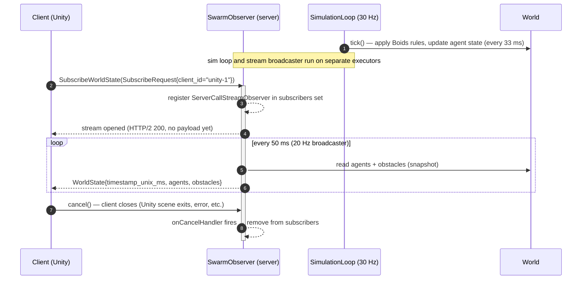

# gRPC contract — SwarmObserver v1

> Reference documentation for the wire protocol between the swarm server and its visualisation clients (Unity, future Raspberry Pi agent, CLI tools).
> Source of truth: [`contracts/src/main/proto/swarm_observer.proto`](../contracts/src/main/proto/swarm_observer.proto).

---

## 1. Overview

The simulator exposes a single user-facing service, `SwarmObserver`, over gRPC. The service follows a **broadcast / observer** pattern:

- A client opens **one** long-lived subscription with `SubscribeWorldState`.
- The server pushes a `WorldState` snapshot at **20 Hz** for as long as the stream stays open.
- The client never sends a second request on the same stream — it only reads, or cancels.

No authentication, no client-to-server upload, no bidirectional messaging. The MVP runs in local and trusts everything on `localhost:50051`.

**Why server-streaming and not unary polling?**
A 20 Hz visualisation over unary calls would mean 20 round-trips per second per client (≈ 60 ms of TCP+HTTP/2 overhead per second). A single server-streaming RPC opens one HTTP/2 stream and reuses it for all frames — lower latency, lower CPU, no client-side scheduler.

---

## 2. Sequence diagram

End-to-end lifecycle of a client session:



**Notes:**
- The simulation tick rate (30 Hz, `SimulationLoop.TICK_RATE_HZ`) and the broadcast rate (20 Hz, `SwarmObserverImpl.STREAM_RATE_HZ`) are intentionally **decoupled**. Clients receive the latest world state, not every physics step.
- The server holds a `Set<ServerCallStreamObserver<WorldState>>`. Each broadcast iterates that set; cancelled subscribers are removed lazily on the next tick.
- The stream **never ends** server-side under normal operation. It is the client that closes it.

---

## 3. Messages

All messages are proto3. Field numbers are stable — never renumber or repurpose, only append.

### 3.1 `Vec3`

```proto
message Vec3 {
  float x = 1;
  float y = 2;
  float z = 3;
}
```

A 3D vector in **meters**, **NED frame** (see §5.1). Used for both positions and velocities — the context is given by the parent field name (`position_xyz` vs `velocity_mps`).

`float` (32-bit) is sufficient: positions are bounded to a 100 × 100 × 50 m world, sub-millimetre precision is wasted on a screen visualisation.

### 3.2 `AgentType`

```proto
enum AgentType {
  AGENT_TYPE_UNSPECIFIED = 0;
  AGENT_TYPE_EXPLORER    = 1;
  AGENT_TYPE_OPERATOR    = 2;
  AGENT_TYPE_CARRIER     = 3;
}
```

Role of a drone in the SAR scenario. The `UNSPECIFIED = 0` member is the proto3-mandated default — receiving it indicates a server bug or a forward-compatibility gap (a future role the client doesn't know about). Clients should render unknown values as a fallback rather than crashing.

The three roles map 1:1 to the domain enum `fr.gakkel.swarmsimulator.swarmserver.domain.AgentType`. In v0.1 all agents are `EXPLORER`; differentiation is planned for v0.4.

### 3.3 `AgentState`

```proto
message AgentState {
  string    id           = 1; // UUID
  AgentType type         = 2;
  Vec3      position_xyz = 3; // meters, NED
  Vec3      velocity_mps = 4; // m/s
}
```

Per-agent snapshot at the broadcast instant.

- `id` — RFC 4122 UUID **as string** (e.g. `"6f5a...c3d2"`). Stable for the lifetime of the agent; clients can use it as a dictionary key for stateful rendering (trails, selection, etc.).
- `type` — see §3.2.
- `position_xyz` — center of the agent, meters, NED.
- `velocity_mps` — instantaneous velocity, m/s, NED. Magnitude is bounded by `BoidsConfig.maxSpeed` (default 5.0 m/s).

No orientation field — agents are point-mass boids in v0.1. Visual heading is derived client-side from `velocity_mps`.

### 3.4 `Obstacle`

```proto
message Obstacle {
  Vec3  position_xyz = 1; // center, meters NED
  float radius_m     = 2;
}
```

A static spherical obstacle. Re-sent on every frame even though it is immutable today — it keeps the protocol simple (no separate "world geometry" RPC) and leaves the door open for dynamic obstacles later.

Obstacles have no `id`. Clients should re-key them by `(position, radius)` or just rebuild the visual list each frame.

### 3.5 `PredatorState`

```proto
message PredatorState {
  string id           = 1;
  Vec3   position_xyz = 2;
  Vec3   velocity_mps = 3;
}
```

Snapshot of the autonomous predator at the broadcast instant.

- `id` — fixed string `"predator-0"` in v0.1 (single predator). Multiple predators would use distinct IDs — clients should key by `id` for stateful rendering.
- `position_xyz` — predator center, meters, NED. Same coordinate frame as `AgentState.position_xyz`.
- `velocity_mps` — instantaneous velocity, m/s, NED. Magnitude bounded by `Predator.SPEED` (3.0 m/s — intentionally slower than boids for dramatic tension).

No orientation field — visual heading is derived client-side from `velocity_mps`.

### 3.6 `WorldState`

```proto
message WorldState {
  int64                    timestamp_unix_ms = 1;
  repeated AgentState      agents            = 2;
  repeated Obstacle        obstacles         = 3;
  repeated PredatorState   predators         = 4;
  SearchStatus             search_status     = 5;
  float                    sensor_radius_m   = 6;
  float                    cohesion_spread_m = 7;
}
```

Full snapshot of the simulated world at instant `timestamp_unix_ms`.

- `timestamp_unix_ms` — server wall clock at the moment the frame was built (`System.currentTimeMillis()`). See §5.3.
- `agents` — every agent in the world. Order is **not** guaranteed; clients must key by `id`.
- `obstacles` — every obstacle in the world. Empty list is legal.
- `predators` — every predator in the world. Contains exactly **1 entry** in v0.1. Empty list is legal (predator-free scenarios). Clients must handle an empty list gracefully — destroy the predator GameObject when the list becomes empty.
- `search_status` — present only when a target has been placed via `PlaceTarget`. Absent until then (proto3 default).
- `sensor_radius_m` — detection radius shared by all agents in metres. Clients use this to size the detection-zone overlay.
- `cohesion_spread_m` — mean position spread (standard deviation from centroid) smoothed over the last 30 ticks (~1 s). Zero until the first tick completes. Used by the Unity HUD and exported to `metrics/cohesion-*.csv`.

Each frame is **self-contained** — no diffing, no deltas. A client that connects mid-simulation receives a complete picture on its very first frame.

### 3.7 `SubscribeRequest`

```proto
message SubscribeRequest {
  string client_id = 1; // arbitrary label for server-side logging
}
```

Sent **once** by the client to open the stream. The only field, `client_id`, is a free-form label (e.g. `"unity-editor"`, `"unity-build-win-1"`, `"cli-debug"`) used by the server to identify subscribers in logs:

```
[swarm-grpc] client 'unity-editor' subscribed — 1 total
[swarm-grpc] client 'unity-editor' disconnected — 0 remaining
```

The server does not validate, deduplicate, or enforce uniqueness on `client_id` — it is purely an operator-facing diagnostic.

---

## 4. RPC — `SubscribeWorldState`

```proto
service SwarmObserver {
  rpc SubscribeWorldState(SubscribeRequest) returns (stream WorldState);
}
```

| Aspect             | Value                                                                    |
| ------------------ | ------------------------------------------------------------------------ |
| Cardinality        | **Server streaming** (1 request → N responses)                           |
| Input              | `SubscribeRequest` (sent once at open)                                   |
| Output             | `stream WorldState`                                                      |
| Target rate        | **20 Hz** (1 frame every 50 ms — `STREAM_RATE_HZ`)                       |
| Frame self-contained | Yes — no deltas, no diffs                                              |
| End of stream      | Client-initiated cancel; server only ends on shutdown                    |
| Backpressure       | Frames are dropped silently on per-subscriber `onNext` failure (see §4.3)|

### 4.1 Streaming semantics

The server's broadcaster runs on a dedicated `ScheduledExecutorService` (thread `swarm-broadcaster`) at a fixed period of `1000 / STREAM_RATE_HZ` ms = **50 ms**. On every tick:

1. Build a single `WorldState` from the current `World` (one allocation per tick, shared across subscribers).
2. For each subscriber, check `isCancelled()`; if so, drop it from the set.
3. Else, call `onNext(state)`. Exceptions are caught — the subscriber is dropped from the set and logged.

There is no heartbeat or keepalive frame separate from `WorldState`. The 20 Hz cadence is dense enough that gRPC's default HTTP/2 connection-level keepalive is sufficient.

### 4.2 Failure modes (client side)

| Symptom                                         | Likely cause                                            |
| ----------------------------------------------- | ------------------------------------------------------- |
| `UNAVAILABLE` on subscribe                      | Server not started, wrong port (default `:50051`)       |
| Stream stalls (no `WorldState` for > 200 ms)    | Server overloaded, GC pause, or sim loop crashed        |
| `CANCELLED` raised on the client                | Client itself cancelled the call (timeout, scene exit)  |
| `INTERNAL` raised mid-stream                    | Server-side exception during `buildWorldState`          |

Clients should treat any terminal status as **end of session** and re-issue `SubscribeWorldState` to recover — the protocol is intentionally idempotent.

### 4.3 Backpressure

The current implementation does **not** flow-control. If a slow client cannot drain frames at 20 Hz, the gRPC outbound buffer fills, `onNext` eventually throws, and the subscriber is dropped. There is no retry. This is acceptable for v0.1 (single Unity client on `localhost`); a token-bucket or `setOnReadyHandler`-based drop policy is on the roadmap if multi-client / WAN delivery becomes a requirement.

---

## 5. Conventions

### 5.1 Coordinate frame — NED (meters)

All `Vec3` values are expressed in the **NED** (North / East / Down) right-handed frame, **in meters**:

| Axis  | Direction     | Range (default world)      |
| ----- | ------------- | -------------------------- |
| `x`   | North         | `[0, 100]` m               |
| `y`   | East          | `[0, 100]` m               |
| `z`   | Down          | `[0, 50]` m                |

**Why NED:** it is the standard aerospace / marine convention, matches the `gakkel-drone-embedded` project, and keeps the door open for real AUV navigation data (compass, depth sensor) in v0.3+.

**Unity client note:** Unity uses a left-handed Y-up frame. Conversion happens on the client at deserialisation, not on the wire:

```
unity.x =  proto.y     // East  → Unity X
unity.y = -proto.z     // Down  → Unity -Y (Y-up)
unity.z =  proto.x     // North → Unity Z
```

### 5.2 Units

| Quantity     | Unit  | Proto field naming convention | Example field    |
| ------------ | ----- | ----------------------------- | ---------------- |
| Position     | meter | `_xyz`                        | `position_xyz`   |
| Velocity     | m/s   | `_mps`                        | `velocity_mps`   |
| Length       | meter | `_m`                          | `radius_m`       |
| Time         | ms    | `_ms` (or `_unix_ms`)         | `timestamp_unix_ms` |

Units are part of the **field name**, not the comment. A field without a unit suffix (e.g. `id`, `type`) carries a non-physical value.

### 5.3 Timestamp — unix ms (int64)

`WorldState.timestamp_unix_ms` is the server wall clock at frame build time, in **milliseconds since the Unix epoch (1970-01-01 UTC)**, as `int64`.

- Server source: `System.currentTimeMillis()`.
- Resolution: 1 ms — sufficient at a 20 Hz cadence (50 ms period).
- Not monotonic across NTP jumps; clients must not derive `dt` by differencing successive timestamps (use the known 50 ms cadence instead).
- `google.protobuf.Timestamp` was rejected: int64-ms is 2× smaller on the wire, easier to log, and lossless until year 292 277 026.

### 5.4 Identity — UUID as string

Agent identity is a string-encoded UUID (RFC 4122). Trade-off vs `bytes(16)`:
- **+** Human-readable in logs and gRPC reflection / `grpcurl` output.
- **−** 36 bytes vs 16 — ≈ 1.7 KiB/s overhead at 20 Hz × 20 agents. Negligible for the MVP.

If that overhead matters in v0.4+ (e.g. 200 agents), the field can be migrated to `bytes id_bin = 5` alongside the existing string for one release, then the string can be deprecated.

### 5.5 Naming and versioning

- **Proto package** carries the major version: `gakkel.swarm.v1`. A breaking change creates `v2`, never edits `v1` in place.
- **Java package**: `io.gakkel.swarm.contracts.v1` (`java_multiple_files = true` so each message is its own `.java`).
- **C# namespace**: `Gakkel.Swarm.Contracts.V1`.
- **Field naming**: `snake_case` in proto (proto3 convention); generators produce idiomatic `camelCase` / `PascalCase` on each language side.
- **Enum members**: prefixed with the enum name (`AGENT_TYPE_EXPLORER`, not `EXPLORER`) per the [Google API style guide](https://protobuf.dev/programming-guides/style/#enums) — avoids collisions in C++ and clarifies log output.
- **Breaking changes**: never remove or renumber a field. Mark obsolete fields with `reserved` and bump the package version when removing a message.

---

## 6. Implementation pointers

| Concern                | File                                                                                      |
| ---------------------- | ----------------------------------------------------------------------------------------- |
| Proto definition       | `contracts/src/main/proto/swarm_observer.proto`                                           |
| Server-side service    | `swarm-server/.../server/SwarmObserverImpl.java` (subscription + broadcast loop)          |
| gRPC server bootstrap  | `swarm-server/.../server/SwarmServer.java` (entry point) + `SwarmServerBootstrap.java` (wiring, `PORT = 50051`) |
| Frame source           | `swarm-server/.../simulation/SimulationLoop.java` (30 Hz Boids tick → `World`)            |
| Domain → proto mapping | `swarm-server/.../server/WorldStateBuilder.java` (`build()` / `toAgentState()` / `toVec3()` / `toProtoObstacle()` / `toPredatorState()`) |

To exercise the stream manually:

```bash
# requires grpcurl + reflection enabled (already wired in SwarmServer)
grpcurl -plaintext -d '{"client_id":"grpcurl"}' \
  localhost:50051 \
  gakkel.swarm.v1.SwarmObserver/SubscribeWorldState
```

---

## 7. Roadmap impact

The contract is intentionally minimal so future iterations slot in without breaking v1 clients:

| Future need                           | Likely extension                                                                |
| ------------------------------------- | ------------------------------------------------------------------------------- |
| Threats (v0.1 SAR scenario)           | ✅ **Done** — `repeated PredatorState predators = 4` on `WorldState`. Autonomous predator chases agents; Unity renders it as a red sphere (see `PredatorRenderer.cs`). |
| Differentiated drones (v0.4)          | Existing `AgentType` enum already covers `OPERATOR` / `CARRIER`                 |
| Pi-agent command channel (v0.3)       | **New** service (`SwarmController`), separate RPC — keep observer read-only    |
| Per-agent telemetry (battery, health) | New `optional` fields on `AgentState` (proto3 `optional` is wire-compatible)    |
| Multi-Pi (v0.6)                       | Server-side scaling first; protocol unchanged                                   |

When in doubt: **add fields, never repurpose them**. Bump the package to `v2` only for true breaking changes.
