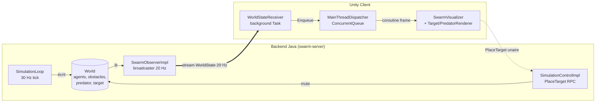
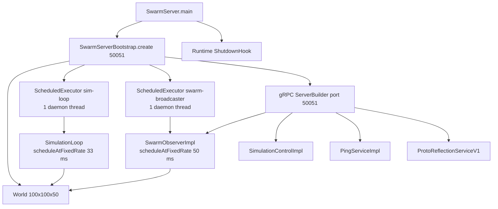
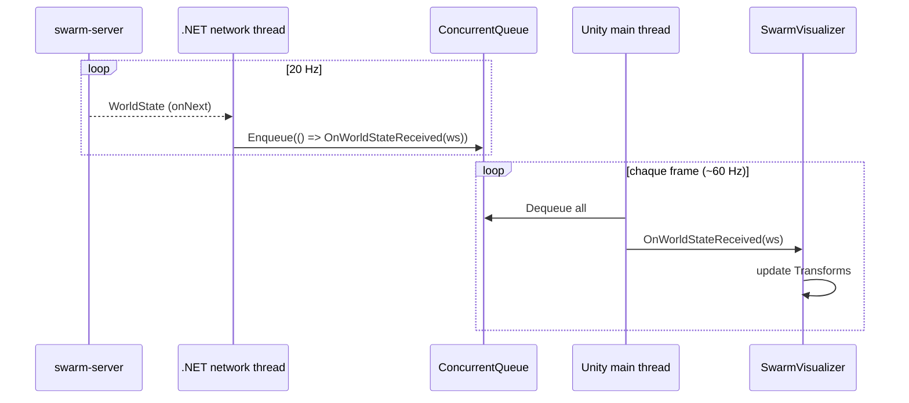

# Architecture — Gakkel Swarm Simulator

> Vue d'ensemble du flux backend Java ↔ Unity pour la v0.1 (MVP SAR).
> Doc bilingue : narration en français, identifiants/composants en anglais.

---

## 1. Vue d'ensemble

Le simulateur est découpé en deux processus indépendants qui communiquent par **gRPC** :

- **Backend Java** : autorité de la simulation. Tient l'état du monde, exécute les règles Boids à 30 Hz, expose le `WorldState` en streaming à 20 Hz.
- **Client Unity** : pur consommateur visuel. Reçoit le `WorldState`, déplace des capsules grises sur le main thread. Renvoie ponctuellement des commandes opérateur (`PlaceTarget`).



Pourquoi ce découpage ? Voir [ADR-0001 — gRPC streaming](adr/0001-grpc-streaming.fr.md) pour le choix du transport, [ADR-0002 — pas de Spring Boot](adr/0002-no-spring-boot-for-mvp.fr.md) pour la frugalité du backend, et [ADR-0003 — assets 3D minimaux](adr/0003-minimal-3d-assets.fr.md) pour le parti pris visuel.

---

## 2. Structure modulaire

### Backend — Maven multi-modules

Racine `pom.xml` (`fr.gakkel.swarmsimulator:swarm-simulator:0.1-SNAPSHOT`, packaging `pom`) avec 3 modules :

| Module          | Rôle                                               | Dépend de    |
|-----------------|----------------------------------------------------|--------------|
| `contracts/`    | Fichiers `.proto` + stubs Java générés (proto3)    | —            |
| `swarm-server/` | Serveur gRPC, domaine, boucle de simulation Boids  | `contracts`  |
| `tests/`        | Tests d'intégration end-to-end                     | `swarm-server` |

Versions clés gérées dans la racine : Java **21**, gRPC **1.81.0**, Protobuf **3.25.5**, JUnit **5.10.2**, Mockito **5.23.0**.

### Backend — packages

```
fr.gakkel.swarmsimulator.swarmserver
├── domain         # Agent, AgentType, World, Vector3D, Predator, Target, Obstacle, BoidsConfig, BoidsRules
├── simulation     # SimulationLoop, SimulationService, SimulationConstants, FlockingDiagnostician,
│                  # CohesionMetric (fenêtre glissante), CohesionCsvExporter
└── server         # SwarmServer (main), SwarmServerBootstrap (wiring),
                   # SwarmObserverImpl, SimulationControlImpl, PingServiceImpl,
                   # WorldStateBuilder
```

### Unity — scripts principaux

```
unity-client/Assets/Scripts/
├── Grpc/
│   ├── WorldStateReceiver.cs       # ouvre le stream, retry auto
│   └── MainThreadDispatcher.cs     # ConcurrentQueue<Action>, coroutine par frame
└── Visualization/
    ├── SwarmVisualizer.cs          # GameObjects agents (capsules)
    ├── TargetRenderer.cs           # sphère cible
    ├── PredatorRenderer.cs         # menace
    ├── SimulationUI.cs             # HUD texte
    └── CameraController.cs         # caméra runtime
```

---

## 3. Cycle de vie du backend

`SwarmServer.main()` ([`SwarmServer.java`](../swarm-server/src/main/java/fr/gakkel/swarmsimulator/swarmserver/server/SwarmServer.java)) délègue tout le wiring à `SwarmServerBootstrap.create(port)` ([`SwarmServerBootstrap.java`](../swarm-server/src/main/java/fr/gakkel/swarmsimulator/swarmserver/server/SwarmServerBootstrap.java)).



Trois groupes de threads coexistent :

1. **`sim-loop`** (1 thread daemon) — exécute `SimulationLoop.tick()` toutes les **33 ms** (TICK_RATE = 30 Hz). Écrit dans `World` (positions/vélocités des `Agent`).
2. **`swarm-broadcaster`** (1 thread daemon) — exécute `SwarmObserverImpl.broadcast()` toutes les **50 ms** (STREAM_RATE = 20 Hz). Lit `World`, construit le proto via `WorldStateBuilder`, pousse `onNext()` à chaque subscriber.
3. **Pool gRPC Netty** — gère les RPC entrants (`SubscribeWorldState`, `PlaceTarget`, `SendPing`).

### Lecture/écriture concurrente du World

L'état partagé est volontairement minimal et tolère le _read tearing_ entre champs (cohérence par champ, pas par snapshot) :

- `Agent.position` et `Agent.velocity` sont `volatile Vector3D` (réassignation atomique de la référence).
- `World.predator` / `World.target` sont `volatile`.
- `World.agents` / `World.obstacles` sont des `List` immutables construites à l'init.

Pas de `synchronized`, pas de `ReadWriteLock` : à 20 Hz un agent peut apparaître entre deux ticks avec une position et une vélocité d'instants légèrement différents — invisible à l'œil.

---

## 4. Contrats gRPC

Tous les `.proto` vivent dans [`contracts/src/main/proto/`](../contracts/src/main/proto/) — package `gakkel.swarm.v1`.

### Services exposés

| Service             | RPC                       | Cardinalité       | Rôle                                |
|---------------------|---------------------------|-------------------|-------------------------------------|
| `SwarmObserver`     | `SubscribeWorldState`     | server-streaming  | Pousser `WorldState` à 20 Hz        |
| `SimulationControl` | `PlaceTarget`             | unaire            | Placer la cible SAR (cf. ADR-0004)  |
| `PingService`       | `SendPing`                | unaire            | Healthcheck                          |

### Messages clés (`swarm_observer.proto`)

```
Vec3            { float x, y, z }                          # NED (North-East-Down)
AgentType       enum { UNSPECIFIED, EXPLORER, OPERATOR, CARRIER }
AgentState      { string id (UUID), AgentType type, Vec3 position, Vec3 velocity }
WorldState      { int64 timestamp_unix_ms,
                  repeated AgentState agents,
                  repeated ObstacleState obstacles,
                  repeated PredatorState predators,
                  SearchStatus search_status,
                  float sensor_radius_m }
SearchStatus    { bool target_placed, Vec3 target_position,
                  float elapsed_sim_s, optional TargetFoundEvent found_event }
```

### Remappage de coordonnées

Le backend utilise un repère **NED** orienté terrain ; Unity utilise un repère **gauche Y-up**. La conversion se fait dans `WorldStateBuilder` ([`WorldStateBuilder.java`](../swarm-server/src/main/java/fr/gakkel/swarmsimulator/swarmserver/server/WorldStateBuilder.java)) au moment de sérialiser :

```
server (x_north, y_east, z_down)  →  proto (x, y, z) = (z_down, x_north, -y_east)
```

Conséquence : **toutes les transformations de repère sont centralisées dans `WorldStateBuilder`**. Le domaine Java raisonne en NED, Unity ne voit que des `Vec3` déjà compatibles avec son monde.

---

## 5. Le tick de simulation

```mermaid
sequenceDiagram
    participant Exec as sim-loop executor
    participant Loop as SimulationLoop
    participant Rules as BoidsRules
    participant World as World
    participant Diag as FlockingDiagnostician

    loop toutes les 33 ms
        Exec->>Loop: tick()
        Loop->>World: snapshot agents
        Loop->>Rules: computeForces(agent, neighbors, predator)
        Rules-->>Loop: cohesion + separation + alignment + flee
        Loop->>World: agent.moveAndUpdate(force, dt)
        Loop->>World: detect target found / predator catch
        Loop->>Diag: tick++ (log toutes les 5 ticks)
    end
```

Détails dans [`SimulationLoop.java`](../swarm-server/src/main/java/fr/gakkel/swarmsimulator/swarmserver/simulation/SimulationLoop.java) et [`BoidsRules.java`](../swarm-server/src/main/java/fr/gakkel/swarmsimulator/swarmserver/domain/BoidsRules.java).

---

## 6. Le flux Unity (threading)

Unity impose que **seul le main thread touche aux `Transform`**. Le stream gRPC arrive sur un thread .NET du pool réseau — il faut un sas. Le pattern complet est documenté dans [`docs/notes-threading-grpc-unity.md`](notes-threading-grpc-unity.md) ; vue condensée :



À 20 Hz côté serveur et 60 fps côté Unity, on traite **~3 WorldState par frame** en moyenne. La queue absorbe le décalage et un retry automatique se déclenche après 3 s si le serveur tombe (`StatusCode.Unavailable`).

---

## 7. Récap des fréquences

| Boucle                                | Fréquence | Période  | Thread                     |
|---------------------------------------|-----------|----------|----------------------------|
| `SimulationLoop.tick`                 | 30 Hz     | 33 ms    | `sim-loop` (1 daemon)      |
| `SwarmObserverImpl.broadcast`         | 20 Hz     | 50 ms    | `swarm-broadcaster` (1 daemon) |
| Unity `MainThreadDispatcher.ProcessQueue` | 60 fps    | ~16 ms   | Unity main thread          |

---

## 8. Pour aller plus loin

- [ADR-0001 — gRPC streaming](adr/0001-grpc-streaming.fr.md)
- [ADR-0002 — pas de Spring Boot pour le MVP](adr/0002-no-spring-boot-for-mvp.fr.md)
- [ADR-0003 — assets 3D minimaux](adr/0003-minimal-3d-assets.fr.md)
- [ADR-0004 — placement de cible déclenché opérateur](adr/0004-target-placement-operator-triggered.fr.md)
- [Notes threading gRPC/Unity](notes-threading-grpc-unity.md)
- [Snapshot tech debt 2026-05-25](tech-debt/tech-debt-2026-05-25.md)
