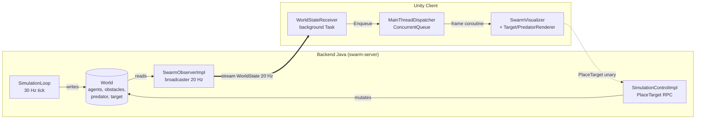
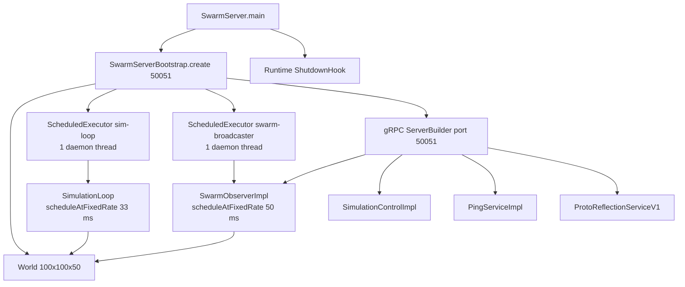
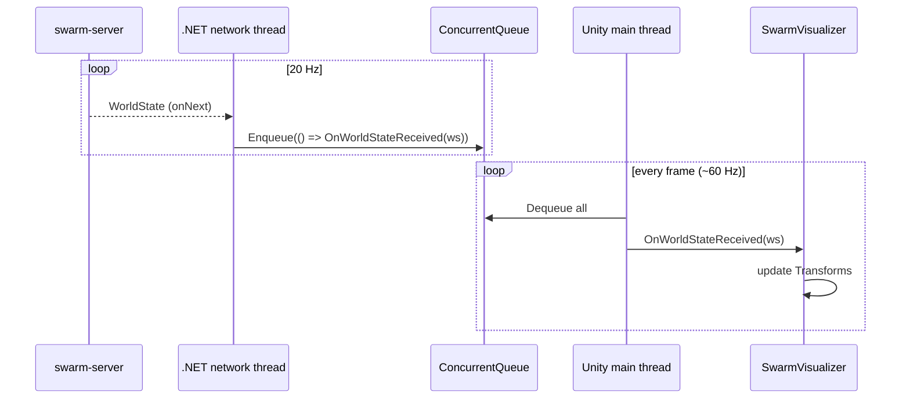

# Architecture — Gakkel Swarm Simulator

> Overview of the Java backend ↔ Unity flow for v0.1 (MVP SAR).
> Bilingual doc: this is the English version, see [`architecture.fr.md`](architecture.fr.md) for French.

---

## 1. Overview

The simulator is split into two independent processes that communicate over **gRPC**:

- **Java backend**: simulation authority. Holds the world state, runs Boids rules at 30 Hz,
  exposes `WorldState` as a 20 Hz stream.
- **Unity client**: pure visual consumer. Receives `WorldState`, moves grey capsules on the
  main thread. Occasionally sends operator commands (`PlaceTarget`).



Why this split? See [ADR-0001 — gRPC streaming](adr/0001-grpc-streaming.md) for the transport choice, [ADR-0002 — no Spring Boot](adr/0002-no-spring-boot-for-mvp.md) for backend frugality, and [ADR-0003 — minimal 3D assets](adr/0003-minimal-3d-assets.md) for the visual stance.

---

## 2. Module layout

### Backend — Maven multi-module

Root `pom.xml` (`fr.gakkel.swarmsimulator:swarm-simulator:0.1-SNAPSHOT`, packaging `pom`) with 3 modules:

| Module          | Role                                                | Depends on     |
|-----------------|-----------------------------------------------------|----------------|
| `contracts/`    | `.proto` files + generated Java stubs (proto3)      | —              |
| `swarm-server/` | gRPC server, domain, Boids simulation loop          | `contracts`    |
| `tests/`        | End-to-end integration tests                        | `swarm-server` |

Key versions managed in the root POM: Java **21**, gRPC **1.81.0**, Protobuf **3.25.5**, JUnit **5.10.2**, Mockito **5.23.0**.

### Backend — packages

```
fr.gakkel.swarmsimulator.swarmserver
├── domain         # Agent, AgentType, World, Vector3D, Predator, Target, Obstacle, BoidsConfig, BoidsRules
├── simulation     # SimulationLoop, SimulationService, SimulationConstants, FlockingDiagnostician
└── server         # SwarmServer (main), SwarmServerBootstrap (wiring),
                   # SwarmObserverImpl, SimulationControlImpl, PingServiceImpl,
                   # WorldStateBuilder
```

### Unity — main scripts

```
unity-client/Assets/Scripts/
├── Grpc/
│   ├── WorldStateReceiver.cs       # opens the stream, auto retry
│   └── MainThreadDispatcher.cs     # ConcurrentQueue<Action>, per-frame coroutine
└── Visualization/
    ├── SwarmVisualizer.cs          # agent GameObjects (capsules)
    ├── TargetRenderer.cs           # target sphere
    ├── PredatorRenderer.cs         # threat
    ├── SimulationUI.cs             # text HUD
    └── CameraController.cs         # runtime camera
```

---

## 3. Backend lifecycle

`SwarmServer.main()` ([`SwarmServer.java`](../swarm-server/src/main/java/fr/gakkel/swarmsimulator/swarmserver/server/SwarmServer.java)) delegates all wiring to `SwarmServerBootstrap.create(port)` ([`SwarmServerBootstrap.java`](../swarm-server/src/main/java/fr/gakkel/swarmsimulator/swarmserver/server/SwarmServerBootstrap.java)).



Three thread groups coexist:

1. **`sim-loop`** (1 daemon thread) — runs `SimulationLoop.tick()` every **33 ms**
   (TICK_RATE = 30 Hz). Writes to `World` (positions/velocities of `Agent`).
2. **`swarm-broadcaster`** (1 daemon thread) — runs `SwarmObserverImpl.broadcast()` every
   **50 ms** (STREAM_RATE = 20 Hz). Reads `World`, builds the proto via `WorldStateBuilder`,
   pushes `onNext()` to every subscriber.
3. **gRPC Netty pool** — handles incoming RPCs (`SubscribeWorldState`, `PlaceTarget`, `SendPing`).

### Concurrent World read/write

Shared state is deliberately minimal and tolerates _read tearing_ between fields
(per-field consistency, not per-snapshot consistency):

- `Agent.position` and `Agent.velocity` are `volatile Vector3D` (atomic reassignment of
  the reference).
- `World.predator` / `World.target` are `volatile`.
- `World.agents` / `World.obstacles` are immutable `List` instances built at init.

No `synchronized`, no `ReadWriteLock`: at 20 Hz an agent can appear between two ticks with
a position and velocity from slightly different moments — invisible to the eye.

---

## 4. gRPC contracts

All `.proto` files live in [`contracts/src/main/proto/`](../contracts/src/main/proto/) — package `gakkel.swarm.v1`.

### Exposed services

| Service             | RPC                       | Cardinality       | Role                                  |
|---------------------|---------------------------|-------------------|---------------------------------------|
| `SwarmObserver`     | `SubscribeWorldState`     | server-streaming  | Push `WorldState` at 20 Hz            |
| `SimulationControl` | `PlaceTarget`             | unary             | Place the SAR target (see ADR-0004)   |
| `PingService`       | `SendPing`                | unary             | Healthcheck                            |

### Key messages (`swarm_observer.proto`)

```
Vec3            { float x, y, z }                          # NED (North-East-Down)
AgentType       enum { UNSPECIFIED, EXPLORER, OPERATOR, CARRIER }
AgentState      { string id (UUID), AgentType type, Vec3 position, Vec3 velocity }
WorldState      { int64 timestamp_unix_ms,
                  repeated AgentState agents,
                  repeated ObstacleState obstacles,
                  repeated PredatorState predators,
                  SearchStatus search_status,
                  float sensor_radius_m }
SearchStatus    { bool target_placed, Vec3 target_position,
                  float elapsed_sim_s, optional TargetFoundEvent found_event }
```

### Coordinate remapping

The backend uses a **NED** ground-oriented frame; Unity uses a **left-handed Y-up** frame.
The conversion happens in `WorldStateBuilder` ([`WorldStateBuilder.java`](../swarm-server/src/main/java/fr/gakkel/swarmsimulator/swarmserver/server/WorldStateBuilder.java)) at serialization time:

```
server (x_north, y_east, z_down)  →  proto (x, y, z) = (z_down, x_north, -y_east)
```

Consequence: **all frame transformations are centralized in `WorldStateBuilder`**. The Java
domain reasons in NED, Unity only sees `Vec3` values already compatible with its world.

---

## 5. The simulation tick

```mermaid
sequenceDiagram
    participant Exec as sim-loop executor
    participant Loop as SimulationLoop
    participant Rules as BoidsRules
    participant World as World
    participant Diag as FlockingDiagnostician

    loop every 33 ms
        Exec->>Loop: tick()
        Loop->>World: snapshot agents
        Loop->>Rules: computeForces(agent, neighbors, predator)
        Rules-->>Loop: cohesion + separation + alignment + flee
        Loop->>World: agent.moveAndUpdate(force, dt)
        Loop->>World: detect target found / predator catch
        Loop->>Diag: tick++ (log every 5 ticks)
    end
```

Details in [`SimulationLoop.java`](../swarm-server/src/main/java/fr/gakkel/swarmsimulator/swarmserver/simulation/SimulationLoop.java) and [`BoidsRules.java`](../swarm-server/src/main/java/fr/gakkel/swarmsimulator/swarmserver/domain/BoidsRules.java).

---

## 6. The Unity flow (threading)

Unity requires that **only the main thread touches `Transform`**. The gRPC stream arrives
on a .NET network pool thread — a bridge is required. The full pattern is documented in
[`03-unity-integration.md`](03-unity-integration.md); condensed view:



At 20 Hz on the server and 60 fps on Unity, we process **~3 WorldState messages per frame**
on average. The queue absorbs the offset, and an automatic retry kicks in after 3 s if the
server goes down (`StatusCode.Unavailable`).

---

## 7. Frequency recap

| Loop                                       | Frequency | Period   | Thread                          |
|--------------------------------------------|-----------|----------|---------------------------------|
| `SimulationLoop.tick`                      | 30 Hz     | 33 ms    | `sim-loop` (1 daemon)           |
| `SwarmObserverImpl.broadcast`              | 20 Hz     | 50 ms    | `swarm-broadcaster` (1 daemon)  |
| Unity `MainThreadDispatcher.ProcessQueue`  | 60 fps    | ~16 ms   | Unity main thread               |

---

## 8. Going further

- [ADR-0001 — gRPC streaming](adr/0001-grpc-streaming.md)
- [ADR-0002 — no Spring Boot for the MVP](adr/0002-no-spring-boot-for-mvp.md)
- [ADR-0003 — minimal 3D assets](adr/0003-minimal-3d-assets.md)
- [ADR-0004 — operator-triggered target placement](adr/0004-target-placement-operator-triggered.md)
- [Boids rules](01-boids-rules.md)
- [gRPC contract](02-grpc-contract.md)
- [Unity integration](03-unity-integration.md)
- [Tech debt snapshot 2026-05-25](tech-debt/tech-debt-2026-05-25.md) (FR)
